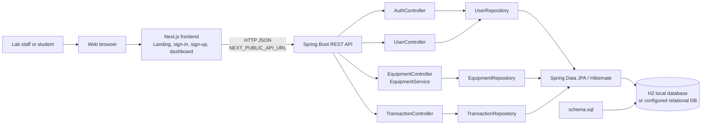
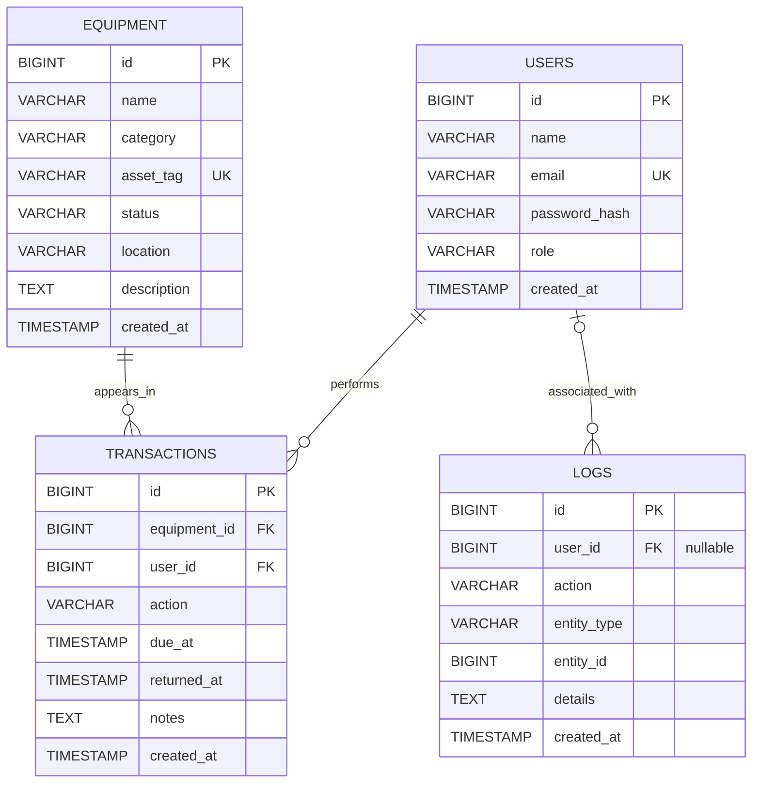
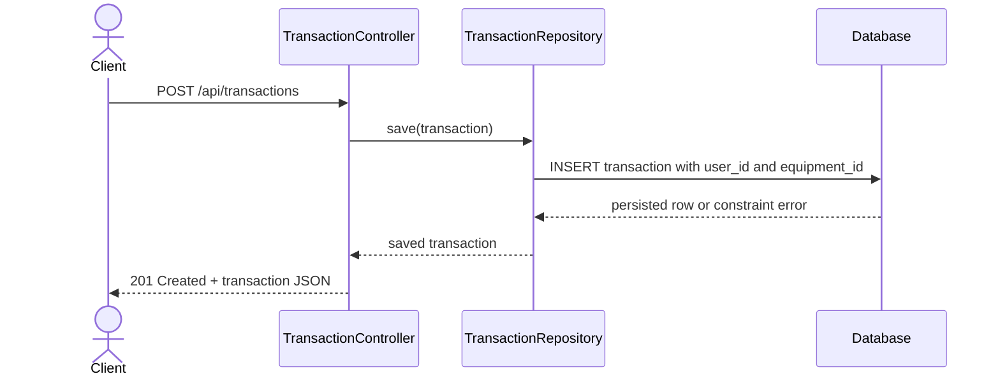
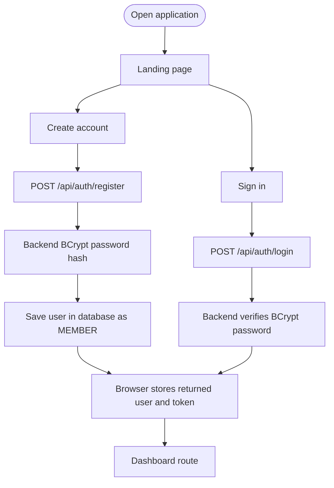

# CLMS | Lab Control Management System

> **Project type:** College Laboratory Management System  
> **Primary assignment areas:** Backend implementation and database integration  
> **Frontend:** Next.js 16, React 19, TypeScript  
> **Backend:** Spring Boot 3.4.4, Java 17, Spring Data JPA  
> **Database:** H2 for local development; optional MySQL profile for Aiven deployment

CLMS is a web application prototype for tracking laboratory users, equipment inventory, and equipment transactions. The repository contains a Next.js user interface and a Spring Boot REST API backed by a relational database schema.

> **Implementation status:** The backend currently provides health, authentication, equipment, user-list, and transaction endpoints. The landing page, sign-in/sign-up forms, and dashboard routes exist. Much of the dashboard's operational content is sample UI data; it is not yet connected to live equipment and transaction APIs. See [Current Scope and Limitations](#current-scope-and-limitations) before presenting the project as production-ready.

---

## Contents

- [1. Project Overview](#1-project-overview)
- [2. System Architecture](#2-system-architecture)
- [3. Database Design](#3-database-design)
- [4. Backend Implementation](#4-backend-implementation)
- [5. Frontend and User Flow](#5-frontend-and-user-flow)
- [6. Run the Project](#6-run-the-project)
- [7. Verify the Database Integration](#7-verify-the-database-integration)
- [8. Tests and Evidence for Submission](#8-tests-and-evidence-for-submission)
- [9. Current Scope and Limitations](#9-current-scope-and-limitations)
- [10. Repository Layout](#10-repository-layout)

## 1. Project Overview

### Problem

Laboratory staff need a consistent way to identify equipment, see its status, and record which user has borrowed or returned it. Separate spreadsheets and informal records make it harder to keep inventory and transaction history consistent.

### Project objective

Build a web-based foundation for laboratory operations with:

- An equipment catalogue with asset tags, category, location, description, and availability status.
- User records with email identity and a role field.
- Transaction records linking a user to equipment and recording an action, due date, return date, and notes.
- REST endpoints that the frontend or an API client can call.
- A relational schema with keys and indexes to preserve data integrity and support common lookups.

### Technology choices

| Layer | Technology | Responsibility |
|---|---|---|
| Web client | Next.js 16, React 19, TypeScript | Landing, account forms, and dashboard routes |
| Styling and icons | Tailwind CSS 4, lucide-react | Application presentation and icons |
| REST API | Spring Boot 3.4.4, Java 17 | HTTP endpoints and backend application logic |
| Persistence | Spring Data JPA, Hibernate | Map backend entities and repository operations to database tables |
| Local database | H2 in-memory | Local development and schema initialization |
| Deployment database | MySQL via MySQL Connector/J | Optional `mysql` Spring profile; Aiven setup is documented separately |
| Frontend package manager | pnpm 12.3.4 | Install and run the web application |
| Backend build | Maven | Compile, test, and run the API |

## 2. System Architecture

The browser talks to the Next.js application. Authentication forms call the Spring Boot API directly. The backend initializes the SQL schema and uses repositories/JPA to read and write the database.



### Request lifecycle

1. A user action in the browser makes an HTTP request to a frontend route or API endpoint.
2. Spring MVC routes API requests to the matching controller.
3. The equipment controller delegates equipment operations to `EquipmentService`; user and transaction operations currently use repositories from their controllers.
4. Spring Data JPA/Hibernate executes persistence operations against the configured database.
5. The API returns a JSON response and an HTTP status code.

### Main backend modules

| Module | Main responsibility | Implemented boundary |
|---|---|---|
| `equipment` | Equipment model, repository, service, and REST controller | Equipment list, lookup, create, update, delete |
| `user` | User model, repository, and REST controller | User list and email lookup for auth |
| `transaction` | Transaction model and REST controller | Transaction list and create |
| `auth` | Registration and login endpoints; optional admin seeding | Register and login only; no server-side authorization enforcement |
| `health` | API health response | Service status and timestamp |
| `common` | Shared API exception handling and not-found exception | Error response support |
| `log` | Audit-log entity | Table/model exists; automatic audit writing and log API are not implemented |

## 3. Database Design

The SQL schema is defined in `backend/src/main/resources/schema.sql`. The application runs it during startup. Hibernate schema generation is disabled (`spring.jpa.hibernate.ddl-auto=none`), so the SQL file is the source of table creation for this setup.

### Entity relationship diagram



`UK` means unique key; `PK` means primary key; `FK` means foreign key. `LOGS.user_id` is nullable in SQL. Transactions require both an existing user and an existing equipment record according to the declared foreign keys.

### Tables and constraints

| Table | Purpose | Important constraints and indexes |
|---|---|---|
| `users` | Account identity, password hash, and role | `id` primary key; unique non-null `email`; non-null `name`, `password_hash`, `role` |
| `equipment` | Lab asset catalogue | `id` primary key; unique non-null `asset_tag`; non-null `name`, `category`, `status`, `location`; index on `status` |
| `transactions` | Equipment activity/loan record | Primary key; required foreign keys to `equipment` and `users`; index on `user_id` |
| `logs` | Audit-log record structure | Primary key; optional foreign key to `users`; index on `created_at` descending |

### Relationships

- One user can be referenced by many transaction records.
- One equipment item can be referenced by many transaction records over time.
- A log entry may be associated with a user; the user reference is nullable.
- The SQL schema declares foreign keys, but the JPA entities currently store the IDs as scalar fields rather than object relationships.

### Database configuration

The default URL is an in-memory H2 database. It is useful for local demos and tests, but **all data disappears when the backend process stops**. Local startup uses `schema.sql`; the optional MySQL Spring profile uses the MySQL-compatible `schema-mysql.sql`.

For Aiven MySQL deployment, see [Aiven MySQL Deployment](docs/AIVEN-MYSQL-DEPLOYMENT.md). Enable the `mysql` Spring profile and supply its database connection variables; setting only a database URL is not sufficient.

## 4. Backend Implementation

### REST endpoint reference

Base URL for local development: `http://localhost:8080`.

| Method | Endpoint | Purpose | Current behavior |
|---|---|---|---|
| `GET` | `/api/health` | Check API availability | Returns status, service name, and timestamp |
| `POST` | `/api/auth/register` | Create an account | Validates fields, hashes password with BCrypt, always creates `MEMBER` |
| `POST` | `/api/auth/login` | Check credentials | Finds email and checks submitted password against BCrypt hash |
| `GET` | `/api/equipment` | List equipment | Returns equipment records |
| `GET` | `/api/equipment/{id}` | Get equipment | Returns record or not-found response |
| `POST` | `/api/equipment` | Add equipment | Creates a record |
| `PUT` | `/api/equipment/{id}` | Update equipment | Updates a record |
| `DELETE` | `/api/equipment/{id}` | Remove equipment | Deletes a record |
| `GET` | `/api/users` | List users | Returns user summaries, not password hashes |
| `GET` | `/api/transactions` | List transactions | Returns transaction records |
| `POST` | `/api/transactions` | Create transaction | Persists a transaction record |

### Example health response

```json
{
  "status": "ok",
  "service": "lab-equipment-api",
  "timestamp": "2026-10-05T12:00:00Z"
}
```

### Example account registration

```http
POST /api/auth/register
Content-Type: application/json

{
  "name": "Alex Student",
  "email": "alex@example.edu",
  "password": "Use-A-Strong-Password"
}
```

A successful registration returns HTTP `201 Created` with a user summary and a generated token. If a `role` is supplied in the request, it is ignored; self-registration cannot create an administrator.

### Example equipment creation

The request body follows the equipment fields in the backend model, for example:

```http
POST /api/equipment
Content-Type: application/json

{
  "name": "Arduino Uno R3",
  "category": "Microcontrollers",
  "assetTag": "ARD-UNO-042",
  "status": "AVAILABLE",
  "location": "Electronics Lab",
  "description": "Development board for teaching and prototyping"
}
```

Use the request/response generated by the actual running API when capturing submission evidence; do not include secrets or real personal data in screenshots.

### Example transaction flow

A transaction row references an existing `user_id` and `equipment_id`. The API currently exposes transaction listing and creation; it does not yet implement a complete approve/issue/return lifecycle.



## 5. Frontend and User Flow

| Route | Purpose | Current state |
|---|---|---|
| `/` | Project landing page | Available; overview values are illustrative sample content |
| `/sign-in` | Submit email and password to `/api/auth/login` | Available; stores returned token and user data in browser local storage |
| `/sign-up` | Create an account through `/api/auth/register` | Available; backend assigns member role |
| `/dashboard` | Authenticated-in-browser dashboard view | Available; dashboard values and operational lists are sample data |
| Other paths | Unimplemented routes | Show not-found page |

### Authentication flow as currently implemented



This is an initial authentication flow, not complete production security: the generated token is not validated by protected backend routes, no Spring Security authorization filter is configured, and browser local storage is used. Do not claim that backend endpoints are protected by user roles.

## 6. Run the Project

### Prerequisites

- Node.js compatible with the installed Next.js release.
- pnpm 12.3.4 (or Corepack/npm invocation shown below).
- Java 17.
- Maven. In the original development environment, Maven was available inside IntelliJ IDEA rather than on `PATH`.

Open two terminals from the repository root.

### Terminal 1: backend

```bash
cd backend
/snap/intellij-idea/132/plugins/maven-plugin/lib/maven3/bin/mvn spring-boot:run
```

The API listens on `http://localhost:8080` by default. Verify it at `http://localhost:8080/api/health`.

If Maven is on your `PATH`, the equivalent command is:

```bash
cd backend
mvn spring-boot:run
```

### Terminal 2: frontend

From the repository root:

```bash
npx pnpm@12.3.4 install
npx next dev -H 0.0.0.0 -p 3000
```

Open `http://localhost:3000`. If port `3000` is occupied, stop the existing frontend process or choose another free port, such as `-p 3001`.

### Production frontend build

```bash
npx next build
```

### Backend test suite

From the repository root:

```bash
/snap/intellij-idea/132/plugins/maven-plugin/lib/maven3/bin/mvn -f backend/pom.xml test
```

## 7. Verify the Database Integration

For a practical local demonstration:

1. Start the backend and confirm `GET /api/health` returns HTTP `200`.
2. Use an API client to call `POST /api/equipment` with a valid equipment record.
3. Call `GET /api/equipment` and show that the created row is returned.
4. Register or otherwise create a user, then create a transaction using an existing user ID and equipment ID.
5. Call `GET /api/transactions` and show the persisted transaction.
6. Show the initialized tables and representative rows in the H2 console if useful. The local H2 console is at `http://localhost:8080/h2-console`; use the JDBC URL printed in the backend startup logs (default `jdbc:h2:mem:lab_equipment`) and username `sa`.

The H2 database is in-memory, so run these checks while the backend process remains active. Do not publish the H2 console or sample credentials to a public deployment.

## 8. Tests and Evidence for Submission

The assignment asks for screenshots demonstrating **(1) backend implementation** and **(2) database integration**, combined into one PDF. Capture evidence from the real running project. This README documents the work; the PDF should contain your group's own screenshots and observations.

### Suggested screenshot plan

| Evidence | Suggested screenshot | What it demonstrates |
|---|---|---|
| Backend starts | Terminal showing Spring Boot startup on port `8080` | Backend service compiles and runs |
| Health endpoint | API client/browser showing `GET /api/health` and HTTP `200` | REST API is reachable |
| Equipment write | API client showing `POST /api/equipment` response | Backend create endpoint accepts and returns data |
| Equipment read | API client showing `GET /api/equipment` including the created record | Backend reads persisted records |
| Database schema | H2 console showing `USERS`, `EQUIPMENT`, `TRANSACTIONS`, and `LOGS` | SQL schema was initialized |
| Database row | H2 console query result for an inserted equipment record | API data was stored in the relational database |
| Transaction integration | API response or database row containing valid `user_id` and `equipment_id` | Transaction persistence and foreign-key relationship |
| Frontend | Landing/sign-in/dashboard screenshot, if requested | Frontend runs and routes are available; does not prove live inventory integration |

### Suggested PDF order

1. Cover page: project title, course/assessment, group name, member names, date.
2. One short project summary and the architecture diagram from this README.
3. Backend implementation evidence: service startup, health endpoint, and representative CRUD request/response.
4. Database integration evidence: ER diagram, initialized schema, and rows written/read through the API.
5. Brief conclusion and current limitations.

Name the final PDF using the group name as required by the instructor (for example, `A12.pdf`). Include only screenshots you personally captured from the running app. Redact passwords, tokens, private email addresses, and unrelated desktop information.

### Existing automated test coverage

The backend test suite currently contains a Spring application-context startup test. It checks that the application can initialize with the configured local database; it is not a full suite of endpoint, database CRUD, authentication, or transaction workflow tests. The frontend production build checks that the Next.js app compiles and routes can be generated.

## 9. Current Scope and Limitations

### Implemented

- Spring Boot API and schema initialization.
- Equipment CRUD endpoints.
- User listing endpoint.
- Transaction list and create endpoints.
- Authentication register/login endpoints with BCrypt password hashing.
- Member-only public registration and optional configurable administrator seeding.
- Next.js landing, sign-in, sign-up, and dashboard routes.
- H2 local database setup and a backend context-load test.

### Not yet implemented or not verified for production

- Dashboard equipment/request/maintenance figures are sample content and are not driven by the API.
- Request approval, maintenance management, reports, calendar scheduling, notifications, and audit-log write workflows are not implemented as complete backend features.
- The logs table/entity exists, but no service currently writes audit events and no log endpoint is exposed.
- Login returns a generated token, but the API does not validate it or protect endpoints; role-based access control is not enforced.
- Browser local storage is used for the current client session state.
- H2 is in-memory and loses data when the backend stops.
- PostgreSQL deployment configuration, migrations, and production deployment have not been demonstrated by the current test suite.
- Automated tests do not yet cover API endpoint behavior, authorization, data constraints, or loan return scenarios.

## 10. Repository Layout

```text
.
├── app/
│   ├── page.tsx                 # Landing page
│   ├── sign-in/page.tsx         # Sign-in form
│   ├── sign-up/page.tsx         # Registration form
│   ├── dashboard/page.tsx       # Dashboard UI
│   └── [...slug]/page.tsx       # Not-found handling for unimplemented paths
├── backend/
│   ├── pom.xml                  # Maven dependencies and Java version
│   └── src/
│       ├── main/java/com/metropolis/lab/
│       │   ├── auth/            # Registration, login, optional admin seed
│       │   ├── equipment/       # Equipment API, service, repository, entity
│       │   ├── transaction/     # Transaction API and entity
│       │   ├── user/            # User API, repository, entity
│       │   ├── log/             # Audit-log entity
│       │   ├── health/          # Health endpoint
│       │   └── common/          # Shared error handling
│       ├── main/resources/
│       │   ├── application.properties
│       │   └── schema.sql       # Relational schema and indexes
│       └── test/                # Backend context-load test
├── components/ui/               # Shared UI components
├── docs/                        # Product and engineering documentation
├── lib/auth.ts                  # Frontend session helpers and API base URL
├── package.json                 # Frontend scripts and dependencies
└── README.md                    # Project and submission guide
```
