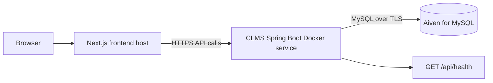

# Deploy CLMS Backend with Aiven MySQL

This guide deploys the Spring Boot backend as a Docker web service and uses an Aiven for MySQL database. The Next.js frontend can be deployed separately and pointed to the backend's public URL.

> Keep database credentials private. Do not commit them into this repository, paste them into screenshots, or place them in frontend variables. The browser must never receive `DB_PASSWORD`.

## Deployment shape



## 1. Create an Aiven MySQL service

1. Create an account at [Aiven](https://aiven.io/) and open the Aiven Console.
2. Create a **MySQL** service. Select a cloud region close to the backend host.
3. Wait until the service reports that it is running.
4. In the service's connection information, record the host, port, database name, username, and password. Use the CA certificate/TLS instructions shown by Aiven for the service.
5. In Aiven's allowed IP/network settings, allow connections from the backend host. Prefer the backend provider's static outbound IPs or private networking when available; avoid opening the database to all IPs (`0.0.0.0/0`) unless it is a temporary, understood development setup.
6. Keep the database credentials in a password manager and the backend host's secret environment-variable configuration.

Aiven's console and network controls can change over time; use the connection details and TLS instructions displayed for your service as authoritative.

## 2. Deploy the backend Docker service

The repository includes `backend/Dockerfile`. A Docker-capable host such as Render can build and run it.

For a Render Web Service:

1. Create a new **Web Service** connected to the Git repository.
2. Choose **Docker** as the runtime.
3. Set the Dockerfile path to `backend/Dockerfile` (or set the service root directory to `backend` and use `Dockerfile`).
4. Configure the environment variables below in the host dashboard.
5. Deploy. The Docker image builds the Spring Boot application; Spring Boot binds to the host-provided `PORT`.

### Backend environment variables

Set these on the backend host, not in frontend code:

| Variable | Value |
|---|---|
| `SPRING_PROFILES_ACTIVE` | `mysql` |
| `DB_HOST` | Aiven service host |
| `DB_PORT` | Aiven service port |
| `DB_NAME` | Aiven database name |
| `DB_USERNAME` | Aiven database username |
| `DB_PASSWORD` | Aiven database password, stored as a secret |
| `AUTH_TOKEN_SECRET` | Stable random secret of at least 32 bytes, shared by all backend instances |
| `APP_ORIGIN` | Optional additional frontend origin, for example `https://your-custom-domain.example.com` |
| `SEED_ADMIN` | `false` normally; only enable when deliberately provisioning an initial admin |
| `ADMIN_EMAIL` | Set only when admin seeding is enabled |
| `ADMIN_PASSWORD` | Strong secret, set only when admin seeding is enabled |
| `PORT` | Set automatically by many app hosts; otherwise use `8080` |

The MySQL profile builds the JDBC URL as:

```text
jdbc:mysql://${DB_HOST}:${DB_PORT}/${DB_NAME}?sslMode=REQUIRED&serverTimezone=UTC
```

Generate a signing secret (for example, `openssl rand -base64 48`) and set it as `AUTH_TOKEN_SECRET` in the backend host's secret environment settings. Keep it stable across deployments and identical on all backend instances; changing it invalidates existing 12-hour login tokens. If it is omitted, the service starts with a random in-memory key, but every restart invalidates all existing sessions and separate instances will not accept each other's tokens. Never expose it through a `NEXT_PUBLIC_*` variable or commit it to source control.

`sslMode=REQUIRED` encrypts the database connection. For certificate and hostname verification, follow Aiven's current Java/MySQL Connector/J instructions and configure its CA certificate/trust store; do not assume encryption alone validates the server's identity.

### Health check

After deployment, open:

```text
https://YOUR-BACKEND-HOST/api/health
```

A successful response is JSON containing `status: "ok"`. Configure the host's health-check path as `/api/health` if it supports health checks.

## 3. Connect the frontend

Deploy the Next.js app to a frontend host such as Vercel. Set this environment variable in the frontend project's settings:

| Variable | Value |
|---|---|
| `NEXT_PUBLIC_API_URL` | `https://ip-clms.onrender.com` with no trailing slash; set this same value in both Vercel projects/domains |

Redeploy/rebuild the frontend after setting it because `NEXT_PUBLIC_*` values are embedded into the browser bundle at build time.

The backend allows the production frontend origins `https://ip-clms.vercel.app` and `https://clms.shreyashvishwakarma.in`, project preview origins matching `https://ip-clms-*.vercel.app`, and local development by default. Both production frontends should point `NEXT_PUBLIC_API_URL` to the same Render backend. After changing the CORS configuration, redeploy the backend. For any other custom frontend domain, set backend `APP_ORIGIN` to that exact origin, including scheme, for example:

```text
APP_ORIGIN=https://clms-team.vercel.app
```

The backend uses these origins for CORS preflight and API responses. `APP_ORIGIN`, `APP_ORIGINS`, or `app.cors.allowed-origins` may add comma-separated exact origins; they do not remove the built-in production and project preview origins.

## 4. Confirm the deployed integration

1. Confirm the backend `/api/health` endpoint returns HTTP `200`.
2. From the deployed frontend, register a test member account and sign in.
4. Use an administrator account to create a test equipment row with `POST /api/equipment`, then read it back with `GET /api/equipment`.
5. Sign in as a member, submit an equipment request in the frontend, and verify it appears in that member's request history.
6. Sign in as an administrator, approve the request, and confirm it creates a loan and marks the equipment in use.
7. Return the loan and confirm the transaction closes and equipment becomes available again; verify the records persist after a backend restart/redeploy.
8. Check the Aiven service metrics/logs for successful client connections.
9. Confirm unauthenticated API requests are rejected and member tokens cannot list users, decide requests, or modify equipment.
10. Delete any test records and accounts that should not remain.

The dashboard loads equipment and transaction records through the backend API. Member transaction reads are scoped to the authenticated member; equipment writes, user listing, and transaction creation require an administrator. Request approval, maintenance tracking, reports, calendar scheduling, and audit-event writing are not implemented as backend workflows.

## Troubleshooting

| Symptom | Check |
|---|---|
| Backend fails to start with MySQL profile | Confirm all `DB_*` variables, active profile `mysql`, and that Aiven service is running |
| Connection timeout/refused | Check Aiven allowed IP/network settings, host, and port |
| TLS/handshake error | Follow Aiven's current CA/TLS setup for Java Connector/J; verify service TLS settings |
| `Access denied` | Recheck Aiven username/password and database grants; do not add spaces or quotes around secret values |
| Missing table error | Confirm `SPRING_PROFILES_ACTIVE=mysql`; the MySQL profile initializes `schema-mysql.sql` |
| Browser CORS error | Set `APP_ORIGIN` to the exact frontend origin and redeploy backend |
| Frontend calls localhost | Set `NEXT_PUBLIC_API_URL` to the public HTTPS backend URL and rebuild/redeploy frontend |
| Login works but dashboard APIs return `401` | Confirm the frontend sends the bearer token and that `AUTH_TOKEN_SECRET` is stable across backend instances/restarts |

## Security and cost notes

- Use HTTPS for the frontend and backend, and TLS for the database connection.
- Use a least-privilege database account where Aiven supports separate users/permissions.
- Never put MySQL credentials in `NEXT_PUBLIC_*` variables.
- Keep admin seeding disabled after the administrator account is provisioned; do not use the example default password in a public service.
- Do not expose the H2 console in a production deployment.
- Review Aiven's plan limits, billing, backups, and service lifecycle before relying on the database for persistent coursework data.
- Operational API routes validate signed bearer tokens and enforce current role checks. Tokens expire after 12 hours; changing `AUTH_TOKEN_SECRET` invalidates them.
- Browser tokens are stored in local storage. HTTPS is required, and production frontend security should include strong cross-site scripting protections.
