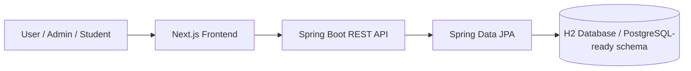

# Architecture

## 1. System overview

CLMS uses a split architecture:

- a Next.js frontend for user interaction and dashboard display
- a Spring Boot backend for API, validation, JPA entities, and service logic
- a local in-memory H2 database for development and testing



## 2. Frontend architecture

The frontend is built with the App Router model in Next.js and uses a single-page dashboard shell with route-driven content.

### Frontend responsibilities
- route navigation between dashboard, inventory, requests, transactions, maintenance, students, calendar, reports, settings
- UI composition and local state management
- data presentation and summary cards
- experience for creating or updating equipment records in modal flows

### Frontend structure

```text
app/
  page.tsx                 # main dashboard and route dispatcher
  [...slug]/page.tsx       # dynamic route fallback pattern
components/
  ui/                      # shared UI primitives
lib/
  utils.ts                 # helper utilities
```

## 3. Backend architecture

The backend follows a Spring Boot layered structure using controllers, services, entities, and repositories.

### Core packages

```text
backend/src/main/java/com/metropolis/lab/
├── common/
│   ├── ApiExceptionHandler.java
│   └── ResourceNotFoundException.java
├── equipment/
│   ├── Equipment.java
│   ├── EquipmentController.java
│   ├── EquipmentRepository.java
│   ├── EquipmentService.java
│   └── EquipmentStatus.java
├── health/
│   └── HealthController.java
├── log/
│   └── AuditLog.java
├── transaction/
│   ├── Transaction.java
│   └── TransactionController.java
├── user/
│   ├── User.java
│   ├── UserController.java
│   └── UserRepository.java
├── LabEquipmentApplication.java
└── ...
```

### Backend responsibilities
- receive HTTP requests from the frontend
- validate incoming payloads
- execute domain logic in service classes
- persist and query JPA entities via repositories
- return structured API responses with clear error handling

## 4. Data model

### Users
- id
- name
- email
- password hash
- role
- createdAt

### Equipment
- id
- name
- category
- assetTag
- status
- location
- description
- createdAt

### Transactions
- id
- equipmentId
- userId
- action
- dueAt
- returnedAt
- notes
- createdAt

### Logs
- id
- userId
- action
- entityType
- entityId
- details
- createdAt

## 5. API layer

### Health
- `GET /api/health`

### Equipment
- `GET /api/equipment`
- `GET /api/equipment/{id}`
- `POST /api/equipment`
- `PUT /api/equipment/{id}`
- `DELETE /api/equipment/{id}`

### Users
- `GET /api/users`

### Transactions
- `GET /api/transactions`
- `POST /api/transactions`

## 6. Design principles

- keep the frontend simple and visually strong for admin workflows
- separate controller and service responsibilities in the backend
- rely on JPA entities and repositories rather than ad-hoc DAO code
- use validation and central exception handling for stable APIs
- keep development setup lightweight and easy to run locally

## 7. Local environment strategy

The project is configured to work without a local PostgreSQL install by default. It uses H2 as a development-ready database engine while keeping the schema compatible with PostgreSQL structures as much as practical.

This is useful for:
- local team onboarding
- fast prototyping
- CI/test stability
- reducing environment blockers

## 8. Security and operations considerations

Current production readiness is limited. Recommended future improvements include:

- end-to-end authentication and authorization
- secure password hashing and session handling
- SCIM or LDAP integration for institutional identity management
- PostgreSQL production profile configuration
- environment-based secrets management
- API rate limiting and auditing

## 9. Scalability direction

The current architecture provides a clean base for growth:

- add more domain services for requests and maintenance
- introduce queue/approval workflows
- connect analytics and reporting dashboards
- migrate to a production database profile
- support multi-campus or multi-lab operations

## 10. Architectural summary

The project is intentionally designed as a pragmatic, implementation-friendly lab dashboard with clear separation between:

- user-facing admin experiences
- backend business logic
- persistent data storage

This makes it easy for a team to continue building features without reworking the system structure.
