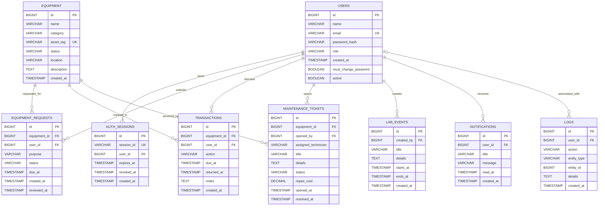

# Current Database Architecture

## Inspection Snapshot

- **Provider:** Aiven for MySQL
- **Server version:** MySQL 8.4.8
- **Database:** `defaultdb`
- **Inspected:** 2026-10-09
- **Application tables:** 9
- **Migration metadata:** `flyway_schema_history`

This document describes the live database schema inspected from Aiven, not a proposed schema. It contains no connection credentials or row-level user data.

## Entity Relationship Diagram

Each `||--o{` relation means one parent row may be referenced by zero or many child rows; each child row references exactly one parent. `LOGS.user_id` is nullable, so a log entry may have no associated user. `UK` marks a unique key; `PK` and `FK` mark primary and foreign keys.

`flyway_schema_history` is a migration-management table rather than an application entity, so it is listed separately below and has no application ERD relationships.

## Tables and Columns

`NOT NULL` is omitted from the column lists below unless called out in the optional-column list. MySQL `BOOLEAN` is stored as `TINYINT(1)`.

### `users`

Account identity, role, password-change requirement, and activation state.

| Column | Type | Constraints / default |
|---|---|---|
| `id` | `BIGINT` | Primary key, auto-increment |
| `name` | `VARCHAR(120)` | Required |
| `email` | `VARCHAR(255)` | Required, unique |
| `password_hash` | `VARCHAR(255)` | Required; stores the password hash, not the plaintext password |
| `role` | `VARCHAR(30)` | Required, default `MEMBER` |
| `created_at` | `TIMESTAMP` | Required, default current timestamp |
| `must_change_password` | `BOOLEAN` | Required, default `FALSE` |
| `active` | `BOOLEAN` | Required, default `TRUE`; false disables sign-in and API access without deleting history |

### `equipment`

Equipment catalogue and current inventory state.

| Column | Type | Constraints / default |
|---|---|---|
| `id` | `BIGINT` | Primary key, auto-increment |
| `name` | `VARCHAR(160)` | Required |
| `category` | `VARCHAR(80)` | Required |
| `asset_tag` | `VARCHAR(80)` | Required, unique |
| `status` | `VARCHAR(30)` | Required, default `AVAILABLE` |
| `location` | `VARCHAR(120)` | Required |
| `description` | `TEXT` | Nullable |
| `created_at` | `TIMESTAMP` | Required, default current timestamp |

### `equipment_requests`

Member requests for equipment, including review state and requested due date.

| Column | Type | Constraints / default |
|---|---|---|
| `id` | `BIGINT` | Primary key, auto-increment |
| `equipment_id` | `BIGINT` | Required, FK to `equipment.id` |
| `user_id` | `BIGINT` | Required, FK to `users.id` |
| `purpose` | `VARCHAR(500)` | Required |
| `status` | `VARCHAR(20)` | Required, default `PENDING` |
| `due_at` | `TIMESTAMP` | Nullable |
| `created_at` | `TIMESTAMP` | Required, default current timestamp |
| `reviewed_at` | `TIMESTAMP` | Nullable |

### `transactions`

Equipment issue/return ledger. A return closes a loan using `returned_at`; the original issue remains represented in the transaction history.

| Column | Type | Constraints / default |
|---|---|---|
| `id` | `BIGINT` | Primary key, auto-increment |
| `equipment_id` | `BIGINT` | Required, FK to `equipment.id` |
| `user_id` | `BIGINT` | Required, FK to `users.id` |
| `action` | `VARCHAR(30)` | Required |
| `due_at` | `TIMESTAMP` | Nullable |
| `returned_at` | `TIMESTAMP` | Nullable |
| `notes` | `TEXT` | Nullable |
| `created_at` | `TIMESTAMP` | Required, default current timestamp |

### `auth_sessions`

Server-tracked bearer-token sessions used for expiry and revocation.

| Column | Type | Constraints / default |
|---|---|---|
| `id` | `BIGINT` | Primary key, auto-increment |
| `session_id` | `VARCHAR(36)` | Required, unique |
| `user_id` | `BIGINT` | Required, FK to `users.id` |
| `expires_at` | `TIMESTAMP` | Required |
| `revoked_at` | `TIMESTAMP` | Nullable |
| `created_at` | `TIMESTAMP` | Required, default current timestamp |

### `maintenance_tickets`

Equipment incidents, technician assignment, cost, and resolution status.

| Column | Type | Constraints / default |
|---|---|---|
| `id` | `BIGINT` | Primary key, auto-increment |
| `equipment_id` | `BIGINT` | Required, FK to `equipment.id` |
| `opened_by` | `BIGINT` | Required, FK to `users.id` |
| `assigned_technician` | `VARCHAR(120)` | Nullable |
| `title` | `VARCHAR(160)` | Required |
| `details` | `TEXT` | Required |
| `status` | `VARCHAR(24)` | Required, default `OPEN` |
| `repair_cost` | `DECIMAL(12,2)` | Nullable |
| `opened_at` | `TIMESTAMP` | Required, default current timestamp |
| `resolved_at` | `TIMESTAMP` | Nullable |

### `lab_events`

Scheduled laboratory events and their creator.

| Column | Type | Constraints / default |
|---|---|---|
| `id` | `BIGINT` | Primary key, auto-increment |
| `created_by` | `BIGINT` | Required, FK to `users.id` |
| `title` | `VARCHAR(160)` | Required |
| `details` | `TEXT` | Nullable |
| `starts_at` | `TIMESTAMP` | Required |
| `ends_at` | `TIMESTAMP` | Nullable |
| `created_at` | `TIMESTAMP` | Required, default current timestamp |

### `notifications`

Private in-app messages and read state per user.

| Column | Type | Constraints / default |
|---|---|---|
| `id` | `BIGINT` | Primary key, auto-increment |
| `user_id` | `BIGINT` | Required, FK to `users.id` |
| `title` | `VARCHAR(160)` | Required |
| `message` | `VARCHAR(500)` | Required |
| `read_at` | `TIMESTAMP` | Nullable; null means unread |
| `created_at` | `TIMESTAMP` | Required, default current timestamp |

### `logs`

Audit events. The user association is optional; action, entity type, and timestamp capture the event summary.

| Column | Type | Constraints / default |
|---|---|---|
| `id` | `BIGINT` | Primary key, auto-increment |
| `user_id` | `BIGINT` | Nullable, FK to `users.id` |
| `action` | `VARCHAR(120)` | Required |
| `entity_type` | `VARCHAR(80)` | Required |
| `entity_id` | `BIGINT` | Nullable |
| `details` | `TEXT` | Nullable |
| `created_at` | `TIMESTAMP` | Required, default current timestamp |

## Relationships and Delete Behavior

| Child table | Foreign key | Parent | Delete/update behavior |
|---|---|---|---|
| `auth_sessions` | `user_id` | `users.id` | `NO ACTION` / `NO ACTION` |
| `equipment_requests` | `equipment_id` | `equipment.id` | `NO ACTION` / `NO ACTION` |
| `equipment_requests` | `user_id` | `users.id` | `NO ACTION` / `NO ACTION` |
| `transactions` | `equipment_id` | `equipment.id` | `NO ACTION` / `NO ACTION` |
| `transactions` | `user_id` | `users.id` | `NO ACTION` / `NO ACTION` |
| `maintenance_tickets` | `equipment_id` | `equipment.id` | `NO ACTION` / `NO ACTION` |
| `maintenance_tickets` | `opened_by` | `users.id` | `NO ACTION` / `NO ACTION` |
| `lab_events` | `created_by` | `users.id` | `NO ACTION` / `NO ACTION` |
| `notifications` | `user_id` | `users.id` | `NO ACTION` / `NO ACTION` |
| `logs` | `user_id` | `users.id` | `NO ACTION` / `NO ACTION` |

The database does not cascade deletes across these relationships. This preserves referential integrity and is why user deactivation is the appropriate lifecycle operation when historical records must remain attached to an account.

## Indexes

| Table | Index | Columns | Purpose / property |
|---|---|---|---|
| `users` | `PRIMARY` | `id` | Primary key |
| `users` | `email` | `email` | Unique account lookup |
| `equipment` | `PRIMARY` | `id` | Primary key |
| `equipment` | `asset_tag` | `asset_tag` | Unique asset identity |
| `equipment` | `idx_equipment_status` | `status` | Status filtering |
| `equipment_requests` | `PRIMARY` | `id` | Primary key |
| `equipment_requests` | `fk_equipment_requests_equipment` | `equipment_id` | Foreign-key lookup |
| `equipment_requests` | `idx_equipment_requests_status` | `status` | Review queue filtering |
| `equipment_requests` | `idx_equipment_requests_user` | `user_id` | Member request history and foreign-key lookup |
| `transactions` | `PRIMARY` | `id` | Primary key |
| `transactions` | `fk_transactions_equipment` | `equipment_id` | Foreign-key lookup |
| `transactions` | `idx_transactions_user` | `user_id` | Member transaction history |
| `auth_sessions` | `PRIMARY` | `id` | Primary key |
| `auth_sessions` | `session_id` | `session_id` | Unique token session lookup |
| `auth_sessions` | `idx_auth_sessions_user` | `user_id` | Session revocation by user |
| `auth_sessions` | `idx_auth_sessions_expiry` | `expires_at` | Expiry lookup |
| `maintenance_tickets` | `PRIMARY` | `id` | Primary key |
| `maintenance_tickets` | `fk_maintenance_user` | `opened_by` | Foreign-key lookup |
| `maintenance_tickets` | `idx_maintenance_equipment` | `equipment_id` | Equipment service history |
| `maintenance_tickets` | `idx_maintenance_status` | `status` | Ticket queue filtering |
| `lab_events` | `PRIMARY` | `id` | Primary key |
| `lab_events` | `fk_lab_events_user` | `created_by` | Foreign-key lookup |
| `lab_events` | `idx_lab_events_start` | `starts_at` | Calendar ordering/range lookup |
| `notifications` | `PRIMARY` | `id` | Primary key |
| `notifications` | `idx_notifications_user_created` | `user_id`, `created_at` | Per-user inbox ordered by recency |
| `logs` | `PRIMARY` | `id` | Primary key |
| `logs` | `fk_logs_user` | `user_id` | Foreign-key lookup |
| `logs` | `idx_logs_created_at` | `created_at` | Recent audit history lookup |

## Migration State

At inspection, Aiven's `flyway_schema_history` contained successful entries for versions 1 (baseline), 2 (`create equipment requests`), and 3 (`add operations and session tables`). The live `users` table already contained `active BOOLEAN NOT NULL DEFAULT TRUE`, but no version 4 history row existed yet. The local V4 migration is idempotent; the next backend startup should verify the column is already present and record V4 as successful without altering existing user rows.

`flyway_schema_history` is a Flyway-managed table with columns `installed_rank`, `version`, `description`, `type`, `script`, `checksum`, `installed_by`, `installed_on`, `execution_time`, and `success`. Do not edit it manually; let Flyway manage its migration records.

## Operational Notes

- User roles, equipment statuses, request states, and maintenance statuses are stored as `VARCHAR`; application validation and business logic constrain their supported values.
- `equipment_requests` and `transactions` are separate lifecycle records. Approving a request creates a transaction; returning equipment closes the loan using `returned_at`.
- `logs.user_id` can be null, but the other listed foreign keys are required.
- Passwords are represented only by `users.password_hash`; this document intentionally contains no credentials or data rows.
