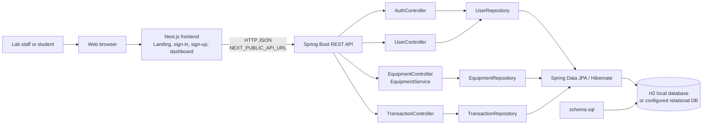
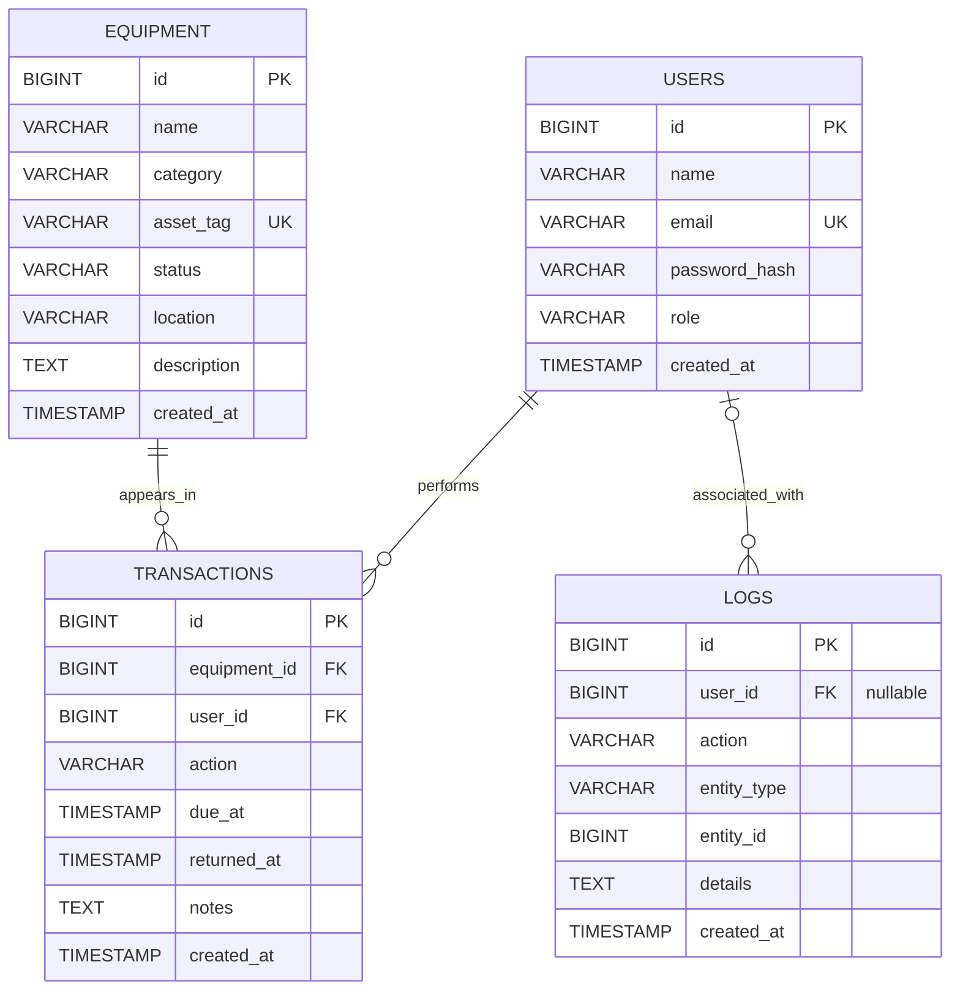

# CLMS Project Report Structure

Use this document as the outline for the group submission report. It is designed around the assignment requirements:

1. Backend implementation
2. Database integration

Fill in the bracketed fields, use screenshots captured from the actual running project, and adapt the length to any requirements given by your instructor. Do not claim that sample dashboard content is live database data or that unfinished features are implemented.

## Suggested Report Length

Approximately 8–12 pages including diagrams and screenshots is a useful target for a concise project report. Follow the instructor's page limit if one has been specified.

## Front Matter

### Cover Page

- **Project:** CLMS — Lab Control Management System
- **Course / subject:** [Course name]
- **Assessment:** [Assessment name or number]
- **Group name:** [Group name, for example A12]
- **Group members:** [Name and student ID for each member]
- **Submission date:** [Date]
- **Contribution summary:** [One sentence per member, if requested]

### Table of Contents

Generate this after the report is assembled so page numbers are accurate.

### List of Figures and Tables

Include this if the report has enough figures/tables to benefit from a list.

## 1. Introduction

### 1.1 Background

Describe the laboratory equipment tracking problem and why a centralized system can help. Keep this specific to the project rather than making unsupported claims about an institution.

### 1.2 Problem Statement

[State the current problem your project addresses, such as keeping equipment records and equipment-use transactions organized and retrievable.]

### 1.3 Objectives

List the objectives that your project actually demonstrates. For example:

- Store and retrieve laboratory equipment records through a backend API.
- Store user and equipment transaction records in a relational schema.
- Demonstrate API-to-database persistence by creating and retrieving records.
- Provide a web interface entry point for the lab management application.

### 1.4 Scope

State which parts are implemented in the submitted version and which remain future work. Distinguish backend/database functionality from sample-only frontend content.

### 1.5 Technology Stack

Summarize the technologies and their roles:

| Component | Technology | Role in the project |
|---|---|---|
| Frontend | Next.js, React, TypeScript | Web pages and browser interaction |
| Backend | Spring Boot, Java | REST API and application logic |
| Persistence | Spring Data JPA / Hibernate | Repository and ORM layer |
| Local database | H2 in-memory | Development and local verification |
| Build tools | pnpm, Maven | Frontend and backend dependency/build workflows |

Update versions based on the actual environment used for your demonstration.

## 2. Requirements and System Design

### 2.1 Users and Roles

Describe intended users. For the current implementation, public registration creates `MEMBER` accounts. Do not state that role-based authorization protects the API; it is not implemented.

### 2.2 Functional Requirements

Document only functionality demonstrated in the submitted build. The current backend includes:

- Health check: `GET /api/health`.
- Authentication: `POST /api/auth/register` and `POST /api/auth/login`.
- Equipment: list, get by ID, create, update, and delete.
- Users: list user summaries.
- Transactions: list and create transaction records.

### 2.3 Non-Functional Requirements

Describe relevant implementation qualities such as input validation, relational constraints, modular organization, and local setup. Explain the actual limitations as well as the design intent.

### 2.4 System Architecture

Use this architecture diagram in the report. It shows the application's major components and the backend persistence path:

Mention that the equipment API has a service layer, while some other controllers currently call repositories directly.

**Figure 1:** CLMS application architecture.

### 2.5 User Flow (Optional)

The authentication flow diagram in the README may be included if it helps explain the application. Explain that the returned token is not currently validated by protected backend routes.

**Figure 2 placeholder:** Sign-in and registration flow.

## 3. Backend Implementation

### 3.1 Backend Structure

Describe the responsibilities of the controllers, services, repositories, entities, shared exception handling, and schema initialization. Use examples from the submitted source code.

### 3.2 REST API Design

Include an endpoint table. Record observed status codes from your own run rather than assuming untested results.

| Method | Endpoint | Purpose | Observed status / result |
|---|---|---|---|
| GET | `/api/health` | Verify API availability | [Fill in] |
| POST | `/api/equipment` | Create equipment | [Fill in] |
| GET | `/api/equipment` | List equipment | [Fill in] |
| GET | `/api/equipment/{id}` | Retrieve equipment by ID | [Fill in] |
| PUT | `/api/equipment/{id}` | Update equipment | [Fill in] |
| DELETE | `/api/equipment/{id}` | Delete equipment | [Fill in] |
| GET | `/api/users` | List user summaries | [Fill in] |
| POST | `/api/transactions` | Create transaction | [Fill in] |
| GET | `/api/transactions` | List transactions | [Fill in] |
| POST | `/api/auth/register` | Register a member account | [Fill in, if demonstrated] |
| POST | `/api/auth/login` | Verify account credentials | [Fill in, if demonstrated] |

### 3.3 Backend Request and Response Example

Include one representative API example. Use fabricated data and redact any credentials or tokens.

**Request:** [Insert endpoint, method, headers, and JSON body.]

**Response:** [Insert HTTP status and relevant JSON response.]

**Explanation:** [Explain which controller/entity/database operation this demonstrates.]

### 3.4 Validation and Error Handling

Describe only behavior confirmed in source or testing. Include a missing-record or invalid-input example only if you have executed it and captured the result.

### 3.5 Authentication (If Included in the Demonstration)

Describe BCrypt password hashing and member-only public registration. State that the generated token is not yet validated by protected endpoints and backend role-based authorization is not yet enforced.

### 3.6 Backend Execution Evidence

Insert screenshots that demonstrate the backend process starts and the API responds.

- **Figure 3:** Spring Boot startup log showing the active port.
- **Figure 4:** `GET /api/health` response with HTTP `200`.
- **Figure 5:** Example API write/read request and response.

## 4. Database Design and Integration

### 4.1 Database Configuration

Explain that local development uses an in-memory H2 database. State clearly that its data is lost when the backend process stops. If you use another database in your demonstration, document the actual database and configuration instead.

### 4.2 Entity Relationship Diagram

Use this ER diagram in the report. It follows the table names, fields, and foreign keys declared in `backend/src/main/resources/schema.sql`.

`PK` means primary key, `UK` means unique key, and `FK` means foreign key. `LOGS.user_id` is nullable. Each transaction references one user and one equipment record; each user or equipment record may be referenced by multiple transactions.

**Figure 6:** CLMS database entity relationship diagram.

### 4.3 Tables, Keys, and Relationships

| Table | Purpose | Important key/relationship details |
|---|---|---|
| `users` | Account identity and role | Primary key `id`; unique email |
| `equipment` | Asset catalogue | Primary key `id`; unique asset tag; status index |
| `transactions` | Equipment activity records | Foreign keys `equipment_id` and `user_id`; user index |
| `logs` | Audit record structure | Optional user foreign key; descending created-at index |

Explain that transaction rows reference existing users and equipment. The SQL schema declares these foreign keys; the Java entities currently store their IDs as scalar fields rather than JPA object associations.

### 4.4 Schema Initialization and Persistence

Describe `backend/src/main/resources/schema.sql`, how it is initialized on application startup, and the configured Hibernate schema-generation setting. Explain which entity/repository operation corresponds to the API request demonstrated in your evidence.

### 4.5 Database Integration Demonstration

Show the complete persistence path:

1. Send a valid create request to the API.
2. Record the successful API response.
3. Retrieve the record through the corresponding list/get endpoint.
4. Confirm the same record in the database console or query result.
5. For a transaction, use existing user and equipment IDs and show the foreign-key values.

**Figure 7:** Database tables shown in H2 console.

**Figure 8:** Equipment row created through the API.

**Figure 9:** Transaction row linked to user and equipment (if demonstrated).

### 4.6 Database Limitations

State whether the demonstration uses in-memory H2 or a persistent database. Do not describe PostgreSQL as deployed unless you have configured and tested it. The repository includes the PostgreSQL driver, but PostgreSQL-specific deployment configuration and migrations have not been validated here.

## 5. Testing and Results

### 5.1 Test Environment

| Tool/component | Version used |
|---|---|
| Operating system | [Fill in] |
| Java | [Fill in] |
| Maven | [Fill in] |
| Node.js | [Fill in] |
| Frontend package manager | [Fill in] |
| Database | [Fill in] |

### 5.2 Automated Tests

Describe the tests that were actually run. The current backend test is a Spring application-context startup test; by itself, it does not verify every endpoint or workflow. Record the command, outcome, and any failures.

### 5.3 Manual Test Cases

| Test ID | Action | Expected result | Observed result | Pass/Fail |
|---|---|---|---|---|
| T01 | Call `GET /api/health` | API returns healthy response | [Fill in] | [Fill in] |
| T02 | Create equipment through API | API returns saved equipment | [Fill in] | [Fill in] |
| T03 | Retrieve equipment list | Created equipment is present | [Fill in] | [Fill in] |
| T04 | Inspect database row | Row matches API-created record | [Fill in] | [Fill in] |
| T05 | Create/list transaction using valid IDs | Transaction is stored and retrieved | [Fill in] | [Fill in] |

Remove or add cases to reflect tests your group actually performed.

### 5.4 Results Summary

Summarize the observed results and refer to the relevant figure numbers. Distinguish automated test results from manual API/database checks.

## 6. Conclusion and Future Work

### 6.1 Conclusion

Summarize what was implemented and which project objectives were demonstrated.

### 6.2 Limitations

Include relevant current limitations, such as sample dashboard content, in-memory database reset, missing server-side token validation/authorization, incomplete operational workflows, and limited automated endpoint coverage.

### 6.3 Future Work

Prioritize the next technical steps, for example:

- Connect dashboard views to backend data.
- Add endpoint, repository, and workflow tests.
- Implement server-validated sessions or JWTs and role-based authorization.
- Complete equipment request, issue, return, and maintenance workflows.
- Configure a persistent production database and migration process.

Tie each reported result and screenshot to the exact project version demonstrated.

